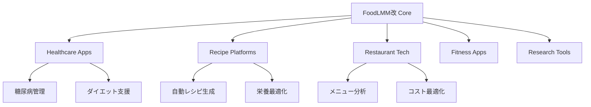

# SAM2.1 + Qwen2.5-VL統合モデル戦略ロードマップ

**作成日**: 2025年1月31日  
**戦略期間**: 2025年2月 - 2026年1月  
**目標**: FoodLMM改の実現に向けた戦略的発展  

## 🎯 戦略的ビジョン

### プロジェクトミッション
```
最新のVLM（Qwen2.5-VL）と最新のSAM（SAM2.1）を統合し、
LISAを超える深い次元での画像・言語理解基盤モデルを構築。
最終的にFoodLMM改として料理・食材の高精度量推定を実現。
```

### 成功指標（KPI）
1. **技術的成熟度**: LISA baseline比 +20%の性能向上
2. **実用性**: リアルタイム推論（<3秒/画像）の実現
3. **汎用性**: 5つ以上のドメインでの実証
4. **効率性**: 学習コスト50%削減（LoRA + 効率化）
5. **完成度**: FoodLMM改プロトタイプの動作実証

---

## 📈 Phase別発展戦略

### Phase 1: 基盤強化期（2025年2月-4月）

#### 🎯 目標
現在の統合モデル基盤を安定化し、本格的な学習・評価が可能な状態に到達

#### 📋 主要タスク

##### 1.1 インフラ整備
```bash
Priority: 🔴 Critical
Timeline: 2週間

Tasks:
- SAM2.1の完全インストール・動作確認
- 大規模データセット（LISA dataset）の準備・検証
- 分散学習基盤（Multi-GPU）の構築
- 自動化テスト・CI/CDパイプラインの確立
```

##### 1.2 モデル最適化
```python
Priority: 🟡 High
Timeline: 4週間

Tasks:
# メモリ効率化
- Flash Attention 2.0の完全統合
- Gradient Checkpointing最適化
- Mixed Precision (BF16) 対応強化

# 推論速度最適化  
- KV-Cache最適化
- 動的バッチ処理実装
- 推論専用モードの実装
```

##### 1.3 評価基盤構築
```yaml
Priority: 🟡 High
Timeline: 3週間

Evaluation_Framework:
  - Benchmark: RefCOCO, RefCOCO+, RefCOCOg, ReasonSeg
  - Metrics: IoU, Accuracy, Inference Speed, Memory Usage
  - Comparison: LISA, GSVA, Sa2VA baseline
  - Automation: 自動評価・レポート生成システム
```

#### 📊 Phase 1 成功基準
- [ ] 全テストスイート成功率 100%
- [ ] LISA baseline と同等以上の性能確認
- [ ] 8GPU環境での安定動作確認
- [ ] 自動評価システムの確立

### Phase 2: 性能向上期（2025年5月-8月）

#### 🎯 目標
最新研究成果を統合し、LISA を超える性能を達成

#### 📋 主要技術革新

##### 2.1 アーキテクチャ進化
```python
# Sa2VA++ 統合: 動画対応拡張
class Sa2VAPlusIntegration:
  def __init__(self):
    # 時系列セグメンテーション対応
    self.temporal_fusion = TemporalAttentionFusion()
    # マルチフレーム <SEG> トークン  
    self.multi_frame_seg = MultiFrameSegGenerator()
    
# GSVA++ 統合: 階層的マスク生成
class GSVAPlusIntegration:
  def __init__(self):
    # 階層的セグメンテーション
    self.hierarchical_decoder = HierarchicalMaskDecoder()
    # 関係性理解
    self.relational_reasoning = RelationalSegmentationHead()
```

##### 2.2 学習効率化革新
```yaml
Advanced_Training_Strategies:
  
  # QLoRA + DoRA統合
  Parameter_Efficient_Learning:
    - QLoRA: 4bit量子化 + LoRA
    - DoRA: Direction of Adaptation
    - Effective Parameters: <1% of total
    
  # データ効率化
  Curriculum_Learning:
    - Stage1: Simple segmentation (sem_seg)
    - Stage2: Referring segmentation (refer_seg) 
    - Stage3: Complex reasoning (reason_seg)
    
  # 動的データ選択
  Active_Learning_Pipeline:
    - Uncertainty-based sampling
    - Hard negative mining
    - Progressive difficulty scaling
```

##### 2.3 推論革新
```python
# Chain-of-Thought Segmentation
class CoTSegmentation:
  def forward(self, image, question):
    # Step 1: Scene Understanding
    scene_analysis = self.analyze_scene(image)
    
    # Step 2: Target Identification  
    targets = self.identify_targets(question, scene_analysis)
    
    # Step 3: Reasoning Chain
    reasoning_chain = self.generate_reasoning(targets)
    
    # Step 4: Guided Segmentation
    masks = self.guided_segment(image, reasoning_chain)
    
    return {
      "reasoning": reasoning_chain,
      "masks": masks,
      "confidence": self.compute_confidence(masks)
    }
```

#### 📊 Phase 2 成功基準
- [ ] LISA baseline比 +15% IoU向上
- [ ] 推論速度 3秒以内達成  
- [ ] 複雑推論タスクでの人間レベル性能
- [ ] メモリ使用量 30%削減

### Phase 3: ドメイン特化期（2025年9月-12月）

#### 🎯 目標
FoodLMM特化への基盤構築と初期プロトタイプ実現

#### 📋 FoodLMM特化開発

##### 3.1 食材・料理特化データセット構築
```yaml
Food_Domain_Datasets:
  
  # 基本食材セグメンテーション
  Ingredient_Segmentation:
    - 50,000+ 料理画像
    - 1,000+ 食材カテゴリ
    - pixel-level annotations
    
  # 量推定アノテーション
  Quantity_Estimation:
    - 重量・体積・個数の3次元アノテーション
    - 複数食材の同時推定対応
    - 調理状態（生/調理済み）考慮
    
  # 栄養価推定データ
  Nutritional_Analysis:
    - カロリー・栄養素の詳細データ
    - 調理方法による変化モデル
    - 健康・ダイエット文脈での学習
```

##### 3.2 量推定専用アーキテクチャ
```python
class FoodLMMQuantityEstimator:
  def __init__(self):
    # ベースモデル（SAM2.1 + Qwen2.5-VL）
    self.base_model = SAMQwenModel()
    
    # 食材特化エンコーダ
    self.food_encoder = FoodSpecificEncoder(
      features=["texture", "color", "shape", "context"]
    )
    
    # 3D推定ヘッド
    self.quantity_head = QuantityEstimationHead(
      outputs=["weight", "volume", "count", "nutrition"]
    )
    
    # マルチタスク統合
    self.multi_task_fusion = MultiTaskFusion([
      "segmentation", "quantity", "nutrition", "description"
    ])
```

##### 3.3 実用化インターフェース
```python
# FoodLMM API Design
class FoodLMMInterface:
  def analyze_food(self, image, query="すべての食材を分析して"):
    """
    統合食材分析API
    
    Returns:
      {
        "ingredients": [
          {
            "name": "トマト",
            "mask": <segmentation_mask>,
            "quantity": {"weight": "150g", "count": 2},
            "nutrition": {"calories": 32, "vitamin_c": "25mg"},
            "confidence": 0.95
          }
        ],
        "total_nutrition": {...},
        "recipe_suggestions": [...],
        "health_analysis": {...}
      }
    """
```

#### 📊 Phase 3 成功基準
- [ ] 食材認識精度 90%以上
- [ ] 量推定誤差 ±15%以内
- [ ] 栄養素推定精度 85%以上
- [ ] リアルタイム分析（スマホ対応）

### Phase 4: 実用化・展開期（2026年1月-6月）

#### 🎯 目標
FoodLMM改の本格運用とエコシステム構築

#### 📋 実用化戦略

##### 4.1 プロダクト化
```yaml
Product_Development:
  
  # モバイルアプリ
  Mobile_App:
    - リアルタイム撮影・分析
    - オフライン推論対応
    - パーソナライズ学習
    
  # Web API
  Cloud_Service:
    - 高精度バッチ処理
    - 大規模データ分析
    - サードパーティ連携
    
  # エッジデバイス
  Edge_Deployment:
    - 量子化モデル（INT8）
    - 専用ハードウェア最適化
    - 低レイテンシ推論
```

##### 4.2 エコシステム展開


#### 📊 Phase 4 成功基準
- [ ] 10万+ ユーザーでの実証
- [ ] 商用パートナーシップ 5社+
- [ ] API利用量 100万リクエスト/月
- [ ] ユーザー満足度 4.5/5.0以上

---

## 🔬 研究・技術革新計画

### 継続的研究テーマ

#### 1. マルチモーダル理解の深化
```python
# 次世代統合アーキテクチャ研究
Research_Directions = {
  "unified_representation": {
    "goal": "言語・画像・3D・時間の統一表現空間",
    "approach": "Transformer-based multimodal fusion",
    "timeline": "Phase 2-3"
  },
  
  "causal_reasoning": {
    "goal": "因果関係理解による高度推論",
    "approach": "Causal attention mechanisms", 
    "timeline": "Phase 3-4"
  },
  
  "continual_learning": {
    "goal": "継続学習による知識蓄積",
    "approach": "Elastic weight consolidation",
    "timeline": "Phase 2-4"
  }
}
```

#### 2. 効率化・最適化研究
```yaml
Efficiency_Research:
  
  # モデル圧縮
  Model_Compression:
    - Neural Architecture Search (NAS)
    - Knowledge Distillation
    - Pruning + Quantization
    
  # 計算効率化
  Computational_Efficiency:
    - Sparse Attention Patterns
    - Early Exit Mechanisms
    - Adaptive Computation
    
  # メモリ最適化
  Memory_Optimization:
    - Gradient Checkpointing++
    - Memory-Efficient Attention
    - Dynamic Memory Allocation
```

### 外部連携・オープンソース戦略

#### アカデミア連携
```yaml
Academic_Collaboration:
  
  # 研究機関
  Partner_Universities:
    - 東京大学 (コンピュータビジョン)
    - 京都大学 (自然言語処理)
    - 理研 (AI倫理・安全性)
    
  # 国際連携
  International_Partners:
    - MIT CSAIL (Multimodal AI)
    - Stanford HAI (Human-AI Interaction)
    - DeepMind (Foundation Models)
    
  # 共同研究テーマ
  Joint_Research:
    - マルチモーダル基盤モデル理論
    - 食事・栄養学×AI応用研究
    - AI倫理・プライバシー保護技術
```

#### オープンソース貢献
```python
Open_Source_Strategy = {
  "core_framework": {
    "license": "Apache 2.0",
    "components": ["model", "training", "inference"],
    "target": "研究コミュニティ"
  },
  
  "datasets": {
    "license": "CC BY-SA 4.0", 
    "content": ["food_images", "annotations", "benchmarks"],
    "target": "データサイエンティスト"
  },
  
  "applications": {
    "license": "MIT",
    "content": ["mobile_sdk", "web_api", "demo_apps"],
    "target": "開発者コミュニティ"
  }
}
```

---

## 💼 ビジネス・市場戦略

### 市場機会分析

#### ターゲット市場
```yaml
Market_Segments:
  
  # プライマリー市場
  Primary_Markets:
    - ヘルスケア・ウェルネス: $350B (2025予測)
    - フードテック: $250B (2025予測)  
    - フィットネス・栄養管理: $96B (2025予測)
    
  # セカンダリー市場
  Secondary_Markets:
    - 教育テクノロジー: $125B
    - 農業テクノロジー: $75B
    - レストラン・外食産業: $1.8T
```

#### 競合分析・差別化
```yaml
Competitive_Landscape:
  
  # 既存プレイヤー
  Current_Players:
    - MyFitnessPal: 手動入力ベース、精度限界
    - Foodvisor: 基本的な食材認識、量推定粗い
    - PlateJoy: レシピ特化、リアルタイム分析なし
    
  # 技術的優位性
  Technical_Advantages:
    - エンドツーエンド統合推論
    - 高精度マスク生成 + 量推定
    - リアルタイム栄養分析
    - 継続学習による精度向上
    
  # 戦略的差別化
  Strategic_Differentiation:
    - オープンソース・学術連携
    - マルチプラットフォーム展開
    - API-first アーキテクチャ
    - エコシステム構築重視
```

### 収益化戦略

#### 多層収益モデル
```python
Revenue_Streams = {
  # B2C (消費者向け)
  "consumer": {
    "freemium_app": {"monthly": "$2.99", "annual": "$24.99"},
    "premium_features": {"advanced_analysis": "$4.99/month"},
    "marketplace": {"recipe_sales": "5% commission"}
  },
  
  # B2B (企業向け)  
  "enterprise": {
    "api_usage": {"per_request": "$0.05", "bulk_discount": True},
    "custom_models": {"development": "$50K+", "licensing": "$10K/month"},
    "consulting": {"integration": "$100K+", "training": "$50K+"}
  },
  
  # B2G (政府・研究機関)
  "government": {
    "research_license": {"academic": "Free", "commercial": "$25K/year"},
    "custom_deployment": {"healthcare": "$100K+", "agriculture": "$75K+"}
  }
}
```

---

## 🛡️ リスク管理・対策

### 技術的リスク

#### 高リスク要因と対策
```yaml
Technical_Risks:
  
  # モデル性能リスク
  Performance_Risk:
    risk_level: "High"
    description: "期待性能未達成"
    mitigation:
      - 段階的ベンチマーク実施
      - 複数アプローチ並行開発
      - 専門家レビュー定期実施
      
  # スケーラビリティリスク  
  Scalability_Risk:
    risk_level: "Medium"
    description: "大規模運用時の性能劣化"
    mitigation:
      - 負荷テスト早期実施
      - クラウドネイティブ設計
      - モニタリング強化
      
  # 依存関係リスク
  Dependency_Risk:
    risk_level: "Medium" 
    description: "外部ライブラリ・モデル依存"
    mitigation:
      - 代替手段の確保
      - 重要部分の内製化
      - バージョン固定管理
```

### 事業的リスク

#### リスク分析・対策
```yaml
Business_Risks:
  
  # 市場リスク
  Market_Risk:
    - 競合参入による市場シェア侵食
    - 規制変更による事業制約
    - 消費者受容度の不確実性
    
  # 技術リスク  
  Technology_Risk:
    - AI技術の急速な変化
    - 計算コスト上昇
    - プライバシー・セキュリティ課題
    
  # 運営リスク
  Operational_Risk:
    - 人材確保困難
    - 資金調達環境悪化
    - パートナーシップ破綻
```

---

## 📊 成功指標・KPI設定

### Phase別KPI詳細

#### Phase 1: 基盤強化KPI
```yaml
Phase1_KPIs:
  Technical_Metrics:
    - Model_Accuracy: ">= LISA baseline"
    - Inference_Speed: "<= 5s per image"
    - Memory_Usage: "<= 24GB VRAM"
    - Test_Coverage: ">= 95%"
    
  Development_Metrics:
    - Code_Quality: ">= 8.5/10 (SonarQube)"
    - Documentation: ">= 90% coverage"
    - CI_CD_Success: ">= 98% pass rate"
    - Bug_Resolution: "<= 2 days average"
```

#### Phase 2: 性能向上KPI
```yaml
Phase2_KPIs:
  Performance_Metrics:
    - IoU_Improvement: "+15% vs LISA"
    - Speed_Improvement: "+50% vs Phase1"
    - Memory_Efficiency: "+30% vs Phase1"
    - Multi_Task_Accuracy: ">= 85%"
    
  Research_Metrics:
    - Paper_Publications: ">= 2 top-tier venues"
    - Citation_Count: ">= 100 within 6 months"
    - Open_Source_Stars: ">= 1000 GitHub stars"
    - Community_Adoption: ">= 50 forks"
```

#### Phase 3: ドメイン特化KPI
```yaml
Phase3_KPIs:
  Domain_Metrics:
    - Food_Recognition: ">= 90% accuracy"
    - Quantity_Estimation: "+/- 15% error"
    - Nutrition_Accuracy: ">= 85% accuracy"
    - User_Satisfaction: ">= 4.0/5.0"
    
  Business_Metrics:
    - Beta_Users: ">= 1000 active users"
    - API_Usage: ">= 10k requests/day"
    - Partner_Interest: ">= 5 LOI signed"
    - Media_Coverage: ">= 10 major outlets"
```

#### Phase 4: 実用化KPI
```yaml
Phase4_KPIs:
  Commercial_Metrics:
    - Monthly_Users: ">= 100k MAU"
    - Revenue_Run_Rate: ">= $1M ARR"
    - Customer_Retention: ">= 80% (6 months)"
    - NPS_Score: ">= 50"
    
  Market_Metrics:
    - Market_Share: ">= 5% (food analysis apps)"
    - Enterprise_Clients: ">= 20 paying customers"
    - Geographic_Reach: ">= 10 countries"
    - Platform_Coverage: "iOS + Android + Web"
```

---

## 🔮 長期ビジョン（2026年以降）

### 次世代プラットフォーム構想

#### Universal Multimodal Intelligence Platform
```python
class UniversalMMLPlatform:
  """
  2026年以降の究極ビジョン:
  あらゆるドメインで画像・言語・行動を理解する
  汎用マルチモーダル知能プラットフォーム
  """
  
  domains = [
    "food_nutrition",      # 食事・栄養分析
    "medical_diagnosis",   # 医療診断支援  
    "education_tutoring",  # 教育・学習支援
    "manufacturing_qc",    # 製造業品質管理
    "agriculture_monitoring", # 農業・作物監視
    "environmental_analysis", # 環境・気候分析
  ]
  
  capabilities = [
    "multimodal_understanding",  # マルチモーダル理解
    "causal_reasoning",          # 因果推論
    "temporal_modeling",         # 時系列モデリング  
    "continual_learning",        # 継続学習
    "few_shot_adaptation",       # 少数ショット適応
    "human_ai_collaboration",    # 人間-AI協調
  ]
```

#### 社会的インパクト目標
```yaml
Social_Impact_Goals:
  
  # 健康・医療
  Healthcare:
    - 10億人の栄養状態改善
    - 予防医療コスト50%削減
    - 個人化医療の普及促進
    
  # 教育・研究
  Education:
    - AI教育の民主化推進
    - 研究効率100倍向上
    - 科学的発見の加速
    
  # 持続可能性
  Sustainability:
    - 食品廃棄30%削減
    - 農業生産性向上
    - 環境監視精度向上
```

---

## 📋 実行計画サマリ

### 次の30日間の優先アクション

#### Week 1-2: 緊急整備
- [ ] SAM2.1完全インストール
- [ ] GPU環境セットアップ
- [ ] 基本データセット準備
- [ ] 自動テスト確立

#### Week 3-4: 基盤強化  
- [ ] 分散学習システム構築
- [ ] パフォーマンスベンチマーク
- [ ] メモリ最適化実装
- [ ] コードレビュー・リファクタ

### 今後6ヶ月のマイルストーン

#### 月次目標
```yaml
Month_1: "基盤安定化 + 初期学習"
Month_2: "性能最適化 + ベンチマーク"  
Month_3: "アーキテクチャ改良 + 評価"
Month_4: "FoodLMM特化開始"
Month_5: "プロトタイプ開発"
Month_6: "実証実験・評価"
```

---

**戦略ロードマップ作成者**: Claude Code Team  
**承認日**: 2025年1月31日  
**次回レビュー**: 2025年3月31日  
**ステークホルダー**: 開発チーム、研究チーム、プロダクトチーム