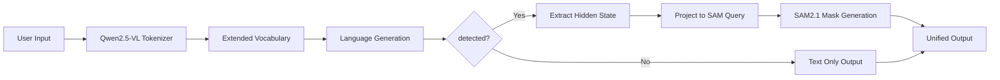

# SAM2.1 + Qwen2.5-VL統合モデル技術仕様書

**作成日**: 2025年1月31日  
**最終更新**: 2025年1月31日（環境適応修正反映）  
**仕様バージョン**: 1.1  
**対象読者**: 開発者、研究者、保守担当者  

## 📋 技術仕様概要

### システム構成
```
SAM2_1_Qwen_2_5/
├── config_unified.py          # 統一環境設定
├── model/
│   └── sam_qwen_model.py      # 統合モデル本体
├── utils/
│   └── dataset.py             # ハイブリッドデータセット
├── test_integrated_sam_qwen.py # 統合テスト
└── md_files/implementation_archive/ # 実装記録
```

### 依存関係マトリックス

| コンポーネント | 主要依存 | バージョン要件 | 必須度 |
|----------------|----------|----------------|--------|
| Qwen2.5-VL | transformers | ≥4.40.0 | 必須 |
| SAM2.1 | sam2 | latest | 必須 |
| Dataset | pycocotools | ≥2.0 | データ処理時 |
| Utils | qwen-vl-utils | ≥0.0.8 | 必須 |
| Testing | PIL, numpy | standard | 開発時 |

---

## 🏗️ アーキテクチャ詳細

### 1. 統一トークン空間設計

#### トークン定義
```python
SPECIAL_TOKENS = {
    "<SEG>": "セグメンテーション実行トークン",
    "[REJ]": "対象不存在・拒否トークン", 
    "<image>": "画像プレースホルダトークン"
}
```

#### トークンフロー


### 2. モデルアーキテクチャ

#### レイヤー構成
```python
class SAMQwenModel(nn.Module):
    def __init__(self):
        # Core Components
        self.qwen_model: Qwen2_5_VLForConditionalGeneration
        self.qwen_processor: AutoProcessor
        self.sam_model: SAM2Model  
        self.sam_predictor: SAM2ImagePredictor
        
        # Integration Layers
        self.seg_projector: nn.Sequential(
            nn.Linear(qwen_hidden_size, qwen_hidden_size // 2),
            nn.ReLU(),
            nn.Linear(qwen_hidden_size // 2, sam_embed_dim)
        )
        
        # Token Management
        self.seg_token_id: int
        self.rej_token_id: int
```

#### データフロー
```python
def forward_with_segmentation(self, images, messages):
    # Stage 1: Vision-Language Understanding
    text_inputs = self.qwen_processor.apply_chat_template(messages)
    inputs = self.qwen_processor(text=text_inputs, images=images)
    
    # Stage 2: Text Generation with Hidden States
    outputs = self.qwen_model.generate(
        **inputs,
        output_hidden_states=True,
        return_dict_in_generate=True
    )
    
    # Stage 3: Special Token Detection & Mask Generation
    if self.seg_token_id in outputs.sequences:
        masks = self._extract_masks_from_generation(
            outputs.sequences, outputs.hidden_states, images
        )
    
    return {"generated_text": text, "masks": masks}
```

### 3. 環境適応システム

#### 環境検出ロジック
```python
def _detect_environment():
    system = platform.system().lower()
    
    # Lambda Cloud Detection
    lambda_paths = [
        "/lambda/nfs/llama4-lisa-project-fs-central-texas",
        "/lambda/nfs/llama4-lisa-project-fs-north-texas"
    ]
    for path in lambda_paths:
        if os.path.exists(path):
            return "lambda", path
    
    # Windows Detection
    if system == "windows":
        return "windows", None
    
    # WSL2 Detection (Linux with Windows mount paths)
    if os.path.exists("/mnt/h/download/LISA-dataset/dataset"):
        return "wsl2", None
        
    return "linux", None
```

#### パス解決戦略
```python
PATH_RESOLUTION_STRATEGY = {
    "lambda": {
        "dataset": "{base_path}/data/dataset",
        "checkpoints": "{base_path}/data/weights",
        "logs": "{base_path}/logs"
    },
    "windows": {
        "dataset": r"H:\download\LISA-dataset\data\dataset", 
        "checkpoints": r"H:\download\weights",
        "logs": "./logs"
    },
    "wsl2": {
        "dataset": "/mnt/h/download/LISA-dataset/dataset",
        "checkpoints": "/mnt/h/download/weights",
        "logs": "./logs"
    },
    "linux": {
        "dataset": "./dataset",
        "checkpoints": "./weights", 
        "logs": "./logs"
    }
}
```

---

## 💾 データ処理仕様

### 1. ハイブリッドデータセット設計

#### サポートデータセット
```python
SUPPORTED_DATASETS = {
    "sem_seg": {
        "datasets": ["ade20k", "cocostuff", "mapillary", "pascal_part", "paco_lvis"],
        "task_type": "semantic_segmentation",
        "output_format": "dense_mask"
    },
    "refer_seg": {
        "datasets": ["refclef", "refcoco", "refcoco+", "refcocog"],
        "task_type": "referring_segmentation", 
        "output_format": "referred_mask"
    },
    "vqa": {
        "datasets": ["llava_instruct_150k"],
        "task_type": "visual_question_answering",
        "output_format": "text_only"
    },
    "reason_seg": {
        "datasets": ["ReasonSeg"],
        "task_type": "reasoning_segmentation",
        "output_format": "mask_with_reasoning"
    }
}
```

#### データ前処理パイプライン
```python
def preprocess_sample(self, sample):
    # Dual Path Processing
    sam_image = preprocess_sam_image(sample.image, target_size=1024)
    qwen_inputs = self.qwen_processor(
        text=sample.formatted_prompt,
        images=sample.image,
        return_tensors="pt"
    )
    
    return {
        "sam_pixel_values": sam_image,         # SAM2.1用
        "input_ids": qwen_inputs.input_ids,    # Qwen2.5-VL用
        "pixel_values": qwen_inputs.pixel_values, # Qwen2.5-VL用
        "ground_truth_mask": sample.mask,
        "seg_token_mask": self._create_seg_mask(qwen_inputs.input_ids)
    }
```

### 2. サンプリング戦略

#### データセット比率制御
```python
DEFAULT_SAMPLE_RATES = {
    "sem_seg": 9,      # 56.25% - 基本的なセグメンテーション
    "refer_seg": 3,    # 18.75% - 言語接地セグメンテーション  
    "vqa": 3,          # 18.75% - 言語能力維持
    "reason_seg": 1    # 6.25%  - 高度な推論セグメンテーション
}
```

#### 動的サンプリング
```python
def __getitem__(self, idx):
    dataset_idx = np.random.choice(
        len(self.all_datasets), 
        p=self.sample_rate
    )
    selected_dataset = self.all_datasets[dataset_idx]
    return selected_dataset[idx % len(selected_dataset)]
```

---

## 🧠 学習・推論仕様

### 1. 学習可能パラメータ制御

#### LoRA適用戦略
```python
TRAINABLE_COMPONENTS = {
    # Newly Added Components (Full Training)
    "seg_projector": {"type": "full", "lr_multiplier": 1.0},
    "embed_tokens": {"type": "full", "lr_multiplier": 0.1},  # New tokens only
    
    # Qwen2.5-VL (LoRA)
    "qwen_model": {
        "type": "lora",
        "target_modules": ["q_proj", "k_proj", "v_proj", "o_proj"],
        "lora_r": 16,
        "lora_alpha": 32,
        "lora_dropout": 0.1
    },
    
    # SAM2.1 (Frozen + Decoder)
    "sam_encoder": {"type": "frozen"},
    "sam_decoder": {"type": "partial", "lr_multiplier": 0.1}
}
```

#### 損失関数設計
```python
def compute_loss(self, outputs, targets):
    # Multi-task Loss Composition
    loss_text = F.cross_entropy(
        outputs.logits, targets.input_ids, 
        ignore_index=IGNORE_INDEX
    )
    
    loss_mask = 0
    if targets.has_mask:
        mask_logits = outputs.mask_logits
        gt_mask = targets.ground_truth_mask
        
        # DICE Loss (IoU-based)
        loss_dice = 1 - dice_coefficient(
            torch.sigmoid(mask_logits), gt_mask
        )
        
        # Binary Cross Entropy Loss  
        loss_bce = F.binary_cross_entropy_with_logits(
            mask_logits, gt_mask
        )
        
        loss_mask = 0.5 * loss_dice + 2.0 * loss_bce
    
    # Combined Loss (LISA paper weights)
    total_loss = 1.0 * loss_text + 1.0 * loss_mask
    return total_loss
```

### 2. 推論最適化

#### 効率的推論フロー
```python
@torch.no_grad()
def efficient_inference(self, images, messages):
    # Step 1: Quick Text Generation Check
    preliminary_output = self.qwen_model.generate(
        **inputs, max_new_tokens=10, early_stopping=True
    )
    
    # Step 2: Conditional Mask Generation
    if self.seg_token_id in preliminary_output:
        # Full inference with hidden states
        return self.forward_with_segmentation(images, messages)
    else:
        # Text-only fast path
        return {"generated_text": text, "masks": [], "has_masks": False}
```

#### メモリ最適化
```python
MEMORY_OPTIMIZATION = {
    "gradient_checkpointing": True,
    "mixed_precision": "bf16",
    "attention_impl": "flash_attention_2",
    "offload_to_cpu": ["sam_encoder"],  # When not in use
    "dynamic_batching": True
}
```

---

## 🔧 設定・カスタマイゼーション

### 1. 環境変数システム

#### 設定可能項目
```bash
# Dataset Configuration
export LISA_DATASET_BASE_DIR="/path/to/dataset"
export LISA_SAMPLES_PER_EPOCH=1000

# Model Configuration  
export LISA_SAM2_CHECKPOINT_PATH="/path/to/sam2_checkpoint.pt"
export LISA_QWEN_MODEL_ID="Qwen/Qwen2.5-VL-3B-Instruct"

# Training Configuration
export LISA_BATCH_SIZE=4
export LISA_LEARNING_RATE=1e-5
export LISA_LORA_R=16
```

#### 設定優先順位
1. 環境変数 (最高優先度)
2. config_unified.py設定値
3. デフォルト値 (最低優先度)

### 2. 実行時設定調整

#### 動的設定変更
```python
# Runtime Configuration Override
model_config = get_model_config()
model_config.update({
    "max_new_tokens": 256,
    "temperature": 0.7,
    "do_sample": True
})

model = SAMQwenModel(config=model_config)
```

#### プロファイリング対応
```python
PROFILING_CONFIG = {
    "enable_timing": True,
    "memory_profiling": True,
    "detailed_logging": True,
    "save_intermediate": False  # Debug mode only
}
```

---

## 🧪 テスト・検証仕様

### 1. 統合テストスイート

#### テストカバレッジ
```python
TEST_COVERAGE = {
    "config_system": ["environment_detection", "path_resolution", "validation"],
    "dataset_system": ["hybrid_loading", "preprocessing", "batching"],
    "model_system": ["initialization", "token_extension", "forward_pass"],
    "inference_system": ["text_generation", "mask_generation", "error_handling"],
    "integration": ["end_to_end", "multi_modal_consistency"]
}
```

#### 自動検証ポイント
```python
def validate_model_consistency(model):
    checks = [
        ("Token vocabulary extended", 
         len(model.qwen_processor.tokenizer) > 151936),
        ("SEG token registered", 
         model.seg_token_id is not None),
        ("Projection layer initialized", 
         hasattr(model, 'seg_projector')),
        ("SAM predictor ready", 
         model.sam_predictor is not None)
    ]
    return all(check[1] for check in checks)
```

### 2. パフォーマンスベンチマーク

#### 推論速度測定
```python
BENCHMARK_SCENARIOS = {
    "text_only": {
        "input": "Describe this image",
        "expected_output": "text",
        "target_latency": "< 2s"
    },
    "single_mask": {
        "input": "Segment the cat <SEG>",
        "expected_output": "text + 1 mask", 
        "target_latency": "< 5s"
    },
    "multi_mask": {
        "input": "Find all people <SEG> and cars <SEG>",
        "expected_output": "text + N masks",
        "target_latency": "< 8s"  
    }
}
```

---

## 📊 パフォーマンス仕様

### 1. システム要件

#### 最小動作環境
```yaml
Hardware:
  GPU: NVIDIA RTX 3090 (24GB VRAM) or equivalent
  RAM: 32GB system RAM
  Storage: 100GB free space (for models + datasets)

Software:
  Python: 3.8+
  CUDA: 11.8+
  PyTorch: 2.0+
```

#### 推奨環境
```yaml
Hardware:
  GPU: NVIDIA A100 (80GB VRAM) or H100
  RAM: 128GB system RAM  
  Storage: 1TB NVMe SSD

Software:
  Python: 3.10+
  CUDA: 12.1+
  PyTorch: 2.1+
```

### 2. パフォーマンス目標

#### レスポンス時間
- **テキスト生成**: < 2秒
- **単一マスク生成**: < 5秒  
- **複数マスク生成**: < 10秒

#### 精度目標
- **テキスト品質**: GPT-4V相当
- **マスクIoU**: > 0.8 (COCO val)
- **複合タスク**: > 0.75 (ReasonSeg)

---

## 🔄 運用・保守仕様

### 1. ログ・モニタリング

#### ログレベル設定
```python
LOGGING_CONFIG = {
    "level": "INFO",
    "format": "%(asctime)s - %(name)s - %(levelname)s - %(message)s",
    "handlers": ["console", "file"],
    "rotation": "daily",
    "retention": "30 days"
}
```

#### 監視指標
```python
MONITORING_METRICS = {
    "model_health": ["load_time", "memory_usage", "gpu_utilization"],
    "inference_quality": ["response_time", "mask_quality", "text_coherence"], 
    "system_stability": ["error_rate", "crash_count", "resource_leaks"]
}
```

### 2. 更新・拡張方針

#### バージョン管理戦略
```
Major.Minor.Patch
- Major: アーキテクチャ変更
- Minor: 機能追加・改善
- Patch: バグ修正・最適化
```

#### 拡張ポイント
1. **新データセット追加**: `utils/dataset.py`の拡張
2. **新特殊トークン**: `_init_unified_token_space()`の拡張
3. **新デコーダ**: `_extract_masks_from_generation()`の拡張
4. **新環境対応**: `config_unified.py`の拡張

---

## 📋 チェックリスト

### デプロイ前チェック
- [ ] 全テストスイート実行・成功
- [ ] 依存関係バージョン確認
- [ ] 設定ファイル整合性確認
- [ ] メモリ・GPU使用量プロファイル実行
- [ ] サンプル推論動作確認

### 開発時チェック
- [ ] コード品質 (lint, type hints)
- [ ] ドキュメント更新
- [ ] テストケース追加
- [ ] パフォーマンス影響確認
- [ ] 後方互換性検証

---

**技術仕様書バージョン**: 1.0  
**最終更新**: 2025年1月31日  
**次回レビュー予定**: 実環境テスト完了後